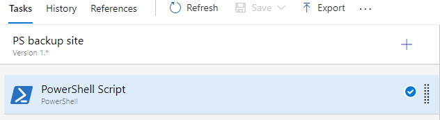
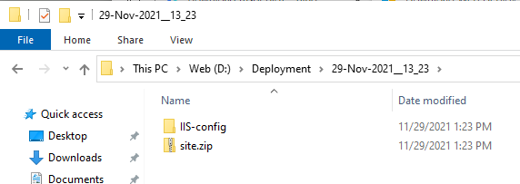

In order to backup your local IIS config files and backing up whole site, you can use Powershell script to perform this operation as part of your release/deployment phase.

### Creating Powershell job as part of your release pipeline

With Azure DevOps you can create Powershell task to be run as part of your release pipeline as shown:

### Powershell script

Run the following script as part of Powershell script job:

    $folder=powershell get-date -format "{dd-MMM-yyyy__HH_mm}"

    Invoke-Expression "& $env:windir\system32\inetsrv\appcmd.exe add backup ""$folder-IIS"""

    xcopy "C:\Windows\System32\inetsrv\backup\$folder-IIS\*" "d:\Deployment\$folder\IIS-config" /i /s /y

    Invoke-Expression "& 'C:\Program Files (x86)\IIS\Microsoft Web Deploy V3\msdeploy.exe' --% -verb:sync -source:iisapp=""Yourwebsite/YourWebservice"" -dest:package=D:\Deployment\$folder\site.zip"
    

Ok, what do we have here:

First, we create temp variable where backup files will be outputted:

    $folder=powershell get-date -format "{dd-MMM-yyyy__HH_mm}"

Here, we are using Powershell 'get-date' function and we will format date to format acceptable for folder name on Windows drive. 

Then we have 

### Checking the output of Powershell task result

Once relase job finishes, following should be seen inside destination backup folder:

